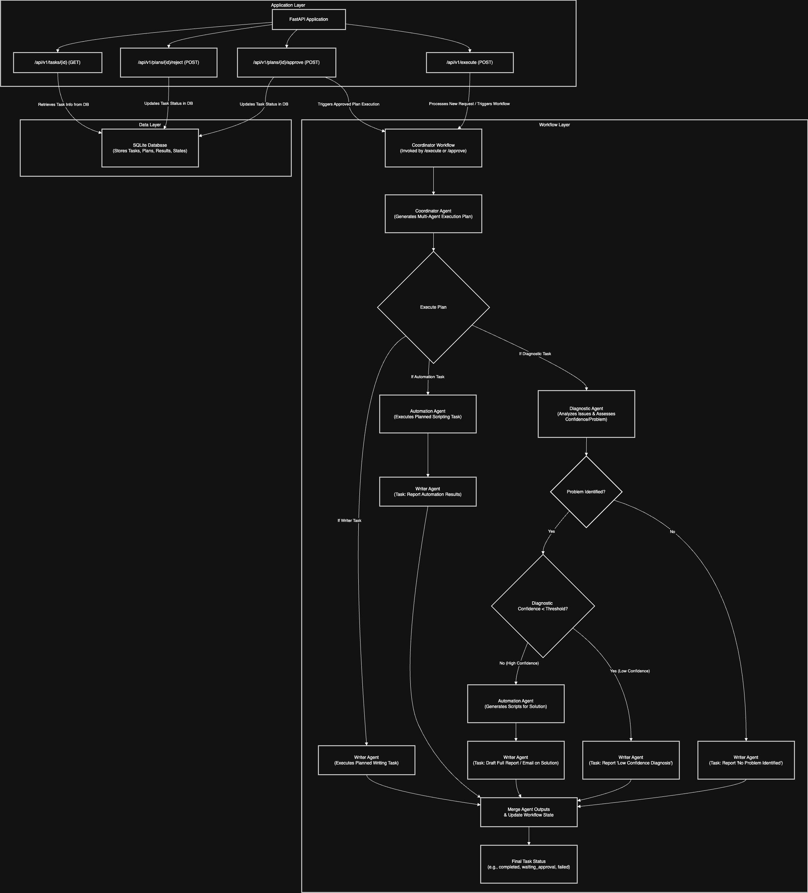

# AI Autopilot

## Overview
AI Autopilot is a FastAPI-based application that automates diagnostic, automation, and writing tasks using AI agents. The application uses DSPy for formatting and output generation.

## Architecture
The architecture of the application is illustrated in the diagram below:



## Implementation
The application is structured as follows:
- **`app/agents/`**: Contains the agent implementations (`writer_agent.py`, `diagnostic_agent.py`, `automation_agent.py`, `coordinator_agent.py`).
- **`app/api/`**: Contains the API endpoints (`endpoints.py`).
- **`app/main.py`**: The main FastAPI application file.
- **`app/models.py`**: Contains the Pydantic models for the application.
- **`app/db/models.py`**: Contains the SQLAlchemy models for the database.
- **`tests/test_core.py`**: Contains the core tests for the application.

## Installation
To install the required packages, follow these steps:
1. Ensure you have Python 3.9 or later installed.
2. Navigate to the project root directory (`AIAutopilot`).
3. Create a virtual environment (optional but recommended):
   ```bash
   python -m venv venv
   source venv/bin/activate  # On Windows, use `venv\Scripts\activate`
   ```
4. Install the required packages:
   ```bash
   pip install -r requirements.txt
   ```

## Running the Application
To run the application, follow these steps:
1. Ensure you are in the project root directory (`AIAutopilot`).
2. Start the FastAPI server using the following command:
   ```bash
   uvicorn app.main:app --reload
   ```
3. The application will be available at `http://127.0.0.1:8000`.

## Running the Tests
To run the core tests, follow these steps:
1. Ensure you are in the project root directory (`AIAutopilot`).
2. Run the tests using the following command:
   ```bash
   python -m pytest tests/test_core.py -v
   ```

## Testing with Postman
To test the API endpoints using Postman, follow these steps:
1. Import the Postman collection file `AI_Autopilot_API.postman_collection.json` into Postman.
2. Replace `{{task_id}}` in the requests with the actual task ID received from the execute response.
3. Run the requests to test the API endpoints.

## API Endpoints
- **`POST /api/v1/execute`**: Execute a task with or without approval.
- **`GET /api/v1/tasks/{id}`**: Get the current state of a task.
- **`POST /api/v1/plans/{id}/approve`**: Approve a task plan.
- **`POST /api/v1/plans/{id}/reject`**: Reject a task plan.


